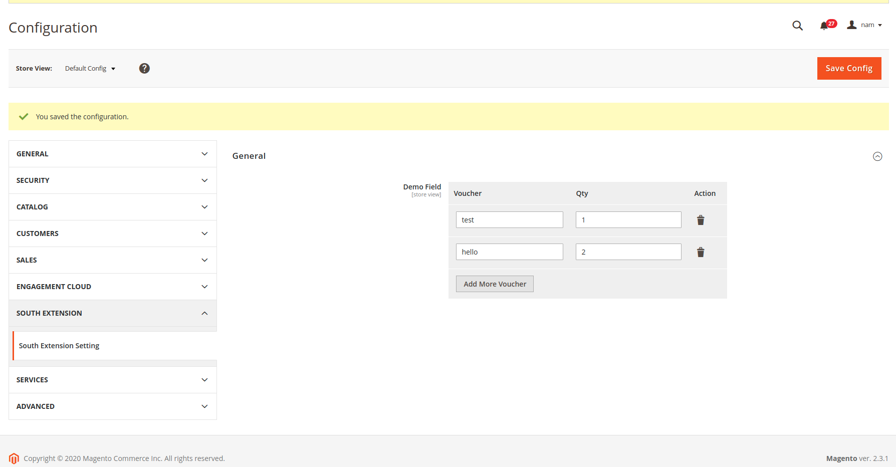
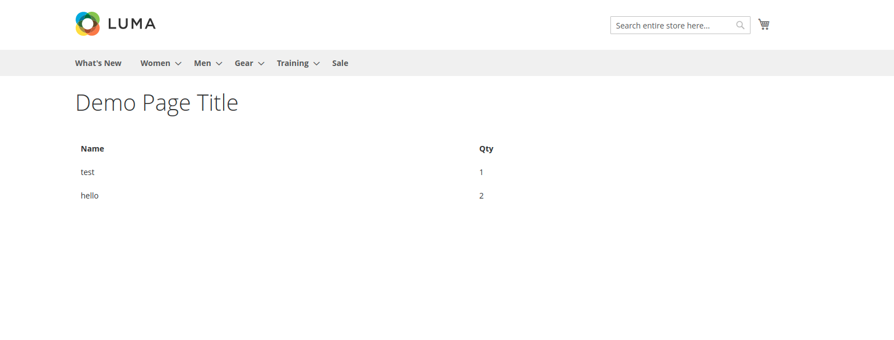

# System Config Advanced for Magento2

    ``south/module-systemconfigadvanced``
    
## Main Functionalities

    ``Create system config field advanced``

## Screenshots

- Backend View

- Frontend View

## Installation
\* = in production please use the `--keep-generated` option

### Type 1: Zip file

 - Unzip the zip file in `app/code/South/SystemConfigAdvanced`
 - Enable the module by running `php bin/magento module:enable South_SystemConfigAdvanced`
 - Apply database updates by running `php bin/magento setup:upgrade`\*
 - Flush the cache by running `php bin/magento cache:flush`

## Configuration

 - Demo Field (general/setting/demo_field)

## User Guide
    
 - Go to Demo Field (general/setting/demo_field)
 - Add a few example fields
 - Go to FE and see the results (base_url/south)

